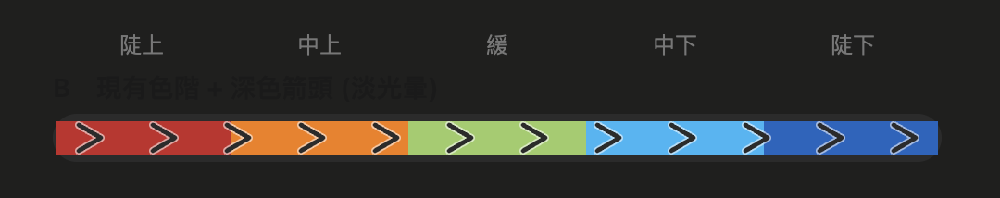

# 坡度與顏色對照

規劃軌跡依帶正負號的坡度角 (上坡為正, 下坡為負) 分五級上色.

| 類別 | 坡度角 | 約等於 % grade | 顏色 | 色碼 |
|:--|:--|:--|:--|:--|
| 陡上 | >= 16° | >= 29% | 紅 | #c62828 |
| 上坡 | 4° - 16° | 7% - 29% | 橙 | #f57c00 |
| 平緩 | -4° - 4° | -7% - 7% | 淺綠 | #9ccc65 |
| 下坡 | -16° - -4° | -29% - -7% | 青 | #29b6f6 |
| 陡下 | <= -16° | <= -29% | 藍 | #1565c0 |

- % grade = tan(角度) x 100; 故 4° 約 7%, 16° 約 29%.
- 坡度為 DEM 沿線每 30m 的平均, 帶正負號 (上坡為正, 下坡為負, 依行進方向判定). 30m 平均會抹平局部陡坎, 實測多落在 +-20° 內.
- 無 DEM 資料時整條退回淺綠.

